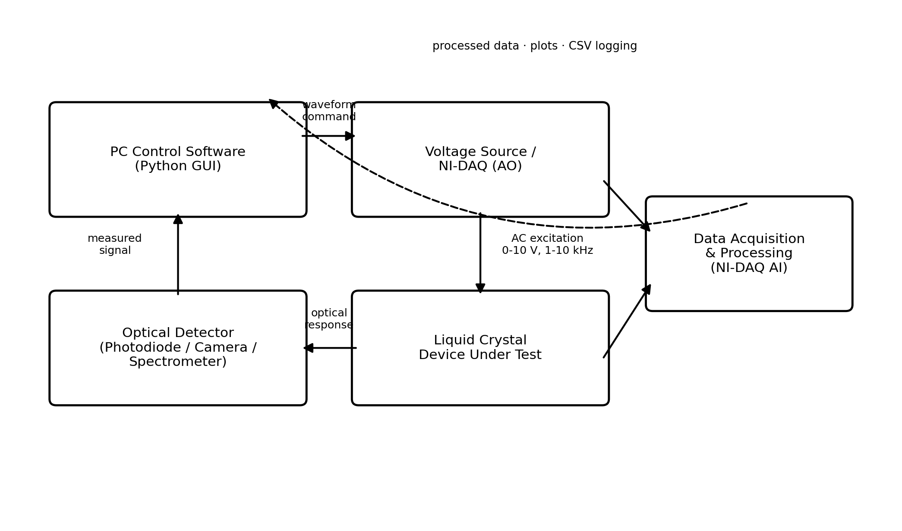
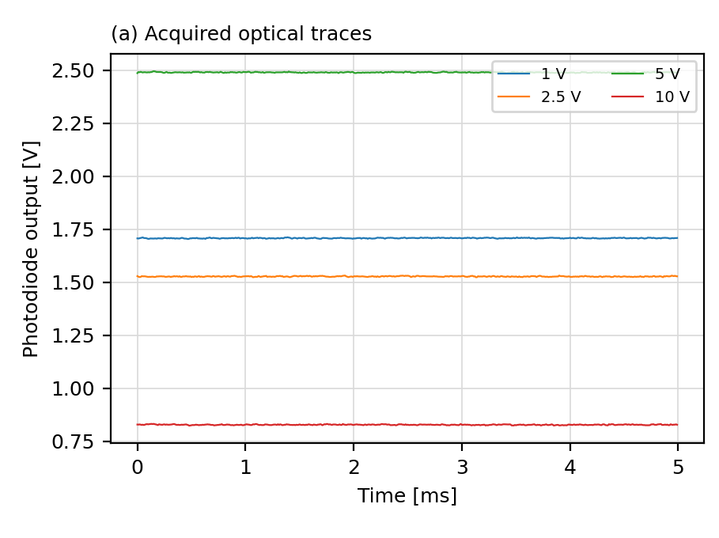
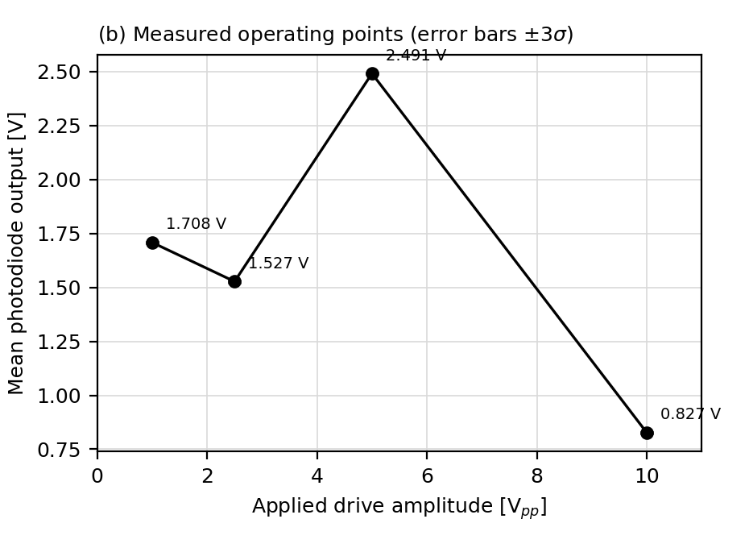
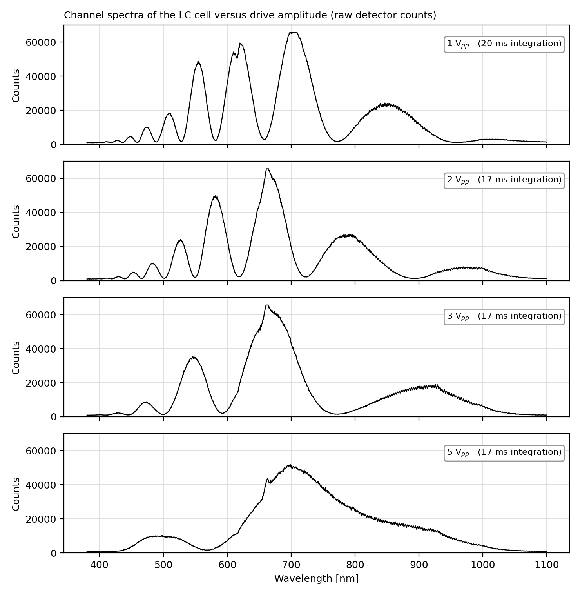
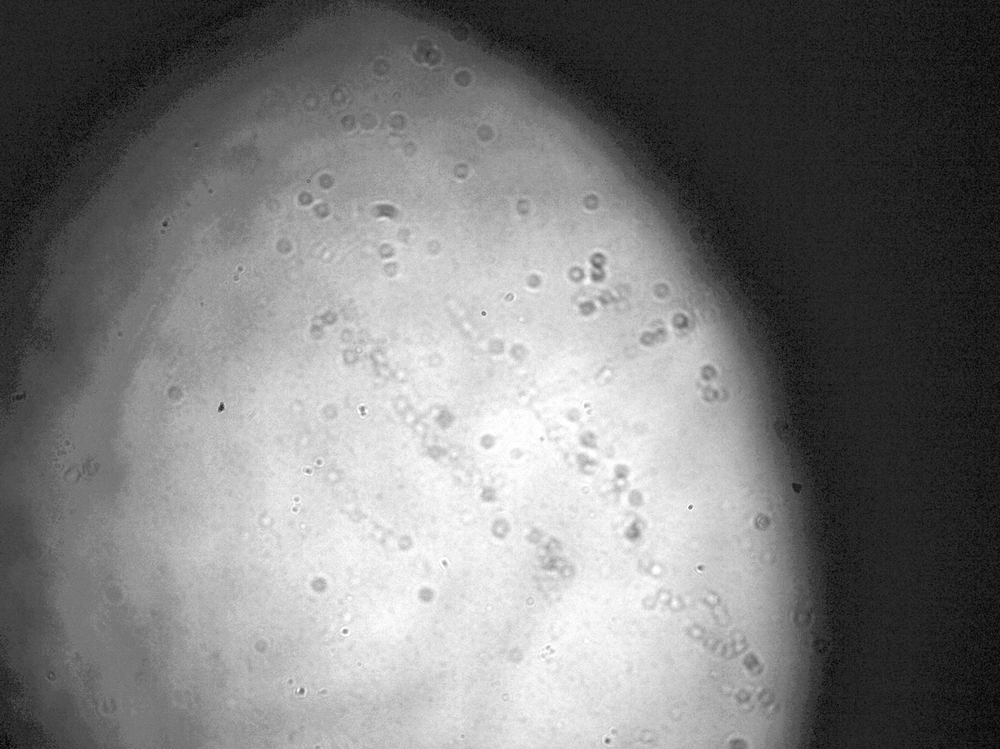

# Liquid-Crystal Characterization System

## Project Overview

A Python-controlled laboratory system for applying AC drive signals to a liquid-crystal cell and acquiring its optical response. The project combines instrument control, a desktop GUI, data acquisition, visualization, and export through photodiode, camera, and spectrometer workflows.

## Main Features

- Tkinter interface with embedded Matplotlib plots and device selection.
- Configurable sine/square drive generation through NI-DAQ analog output.
- Photodiode acquisition, camera capture, and Avantes spectrometer integration.
- Measurement export, including CSV/Excel data and camera images.
- Spectrometer dark/reference capture and transmission/absorbance processing modes.

## Architecture

`GUI.py` contains the application, device-selection dialog, drive-output logic, and detector interfaces. NI hardware drives the cell and reads the photodiode; the camera and spectrometer use their own acquisition interfaces.

*The report’s conceptual diagram summarizes PC control, electrical drive, the liquid-crystal cell, and optical acquisition.*

## Tools and Hardware

Python, Tkinter, NumPy, Matplotlib, OpenCV, `nidaqmx`, `openpyxl`, and Windows camera/COM interfaces. The reported setup uses NI 9264 analog output, NI 9205 analog input, a Tucsen ISH1000 camera, an Avantes AvaSpec spectrometer, and a 17.32 µm E7 liquid-crystal cell.

## Experimental Results

At a 1.25 kHz square-wave drive, the report records these steady-state photodiode measurements:

| Cell drive | Mean photodiode output |
| --- | ---: |
| 1 Vpp | 1.708 V |
| 2.5 Vpp | 1.527 V |
| 5 Vpp | 2.491 V |
| 10 Vpp | 0.827 V |

The reported spectra show reduced fringe contrast at higher drive. Values are raw detector counts; the 1 Vpp trace uses a different integration time, so absolute amplitudes are not directly comparable.

Camera acquisition was demonstrated, but the reported 0.67% intensity variation was below the stated 1% stability level and does not establish a resolved electro-optical response.

*Panel (a) of the report’s photodiode figure shows steady-state detector output over 5 ms at four drive settings; these are not switching-time measurements.*

*Panel (b) shows the four measured drive/output pairs with ±3σ error bars; the connecting segments do not represent a dense voltage sweep.*

*The reported raw-count spectra show reduced fringe contrast at higher drive. Integration time differs for the 1 Vpp trace, so absolute amplitudes are not directly comparable.*

*The report’s CMOS image demonstrates the imaging path. It does not establish voltage-dependent optical contrast or calibrated uniformity.*

## Repository Structure

- `GUI.py`: application and instrument interfaces.
- `fin-2026-129.pdf`: project report and measurements.
- `docs/images/`: five selected design and results figures.

## How to Run

1. Prepare a Windows Python environment with Tkinter and the packages listed above. Camera support additionally uses `pygrabber`, `comtypes`, and `pywin32`.
2. Install NI-DAQmx and the required camera/spectrometer drivers. Install the Avantes SDK or place its DLL beside the script, matching the Python architecture.
3. Connect the instruments, confirm the DAQ channels, and launch `python "GUI.py"`.
4. Select the acquisition device, configure the measurement, and save results through the GUI.

Package versions, vendor drivers/DLLs, and a complete installation configuration are not bundled.

## Attribution

Project by **Omar Wattad**, supervised by **Prof. Ibrahim Abdulhalim**, at Ben-Gurion University.
